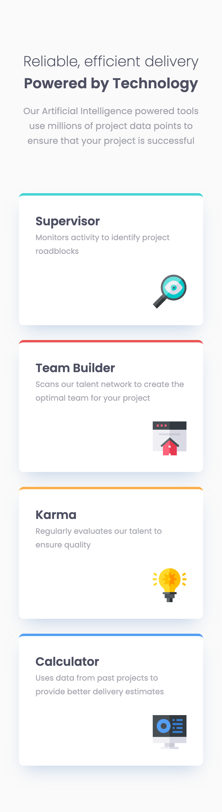

# Frontend Mentor - Four card feature section solution

This is a solution to the [Four card feature section challenge on Frontend Mentor](https://www.frontendmentor.io/challenges/four-card-feature-section-weK1eFYK). Frontend Mentor challenges help you improve your coding skills by building realistic projects.

## Table of contents

- [Overview](#overview)
  - [The challenge](#the-challenge)
  - [Screenshot](#screenshot)
  - [Links](#links)
- [Getting Started](#getting-started)
  - [Prerequisites](#prerequisites)
  - [Installation](#installation)
- [My process](#my-process)
  - [Built with](#built-with)
  - [What I learned](#what-i-learned)
  - [Continued development](#continued-development)
  - [Useful resources](#useful-resources)
- [Author](#author)

## Overview

### The challenge

Users should be able to:

- View the optimal layout for the site depending on their device's screen size

### Screenshot

<div style='display: flex; gap: 10px;'>



</div>

### Links

- Solution URL: [https://www.frontendmentor.io/solutions/four-card-feature-section-with-nextjs-tailwind-css-pBE9P3QOXt]
- Live Site URL: [https://four-card-feature-section-gold-three.vercel.app]

## Getting Started

To get a local copy up and running follow these simple steps:

### Prerequisites

Make sure you have the following software installed on your machine:

- [Node.js](https://nodejs.org/) (Node.js 18.17 or later)
- [pnpm](https://pnpm.io/)

### Installation

1. Clone the repository:

   ```sh
   git clone https://github.com/jaceleedev/four-card-feature-section.git
   ```

2. Navigate to the project directory:

   ```sh
   cd four-card-feature-section
   ```

3. Install dependencies using pnpm:

   ```sh
   pnpm install
   ```

4. Start the development server:

   ```sh
   pnpm dev
   ```

5. Open your browser and visit http://localhost:3000 to view the project.

## My process

### Built with

- Next.js (v14.2.5)
- TypeScript (v5)
- Tailwind CSS (v3.4.1)
- Semantic HTML5 markup
- CSS Grid, Flexbox
- SEO & web accessibility

### What I learned

Throughout this project, I gained valuable insights and improved my skills in several areas:

I've come to understand when to apply the mobile-first approach. If there isn't a significant difference between mobile and desktop views, it's better to start with the mobile screen. However, if the desktop and mobile views are drastically different with substantial design variations, it's preferable to begin with the desktop view.

It's important to note that if you're designing the mobile view while constantly considering a complex desktop layout, you're no longer following a true mobile-first approach. The essence of mobile-first is to design for mobile without the constraints of desktop considerations.

These learnings have not only improved my technical skills but also given me a clearer direction for future growth and areas to focus on in upcoming projects.

### Continued development

In future projects, I want to continue focusing on and improving in these areas:

Moving forward, I plan to thoroughly examine the overall design before starting a project and strategize which approach would be most suitable. I've also realized the need to use CSS Grid more proactively. Even with complex layouts, Grid proves to be much easier to work with compared to Flexbox. It offers more flexibility and control, making it easier to respond to various layout challenges.

By focusing on these areas, I hope to continually improve my front-end development skills and create more efficient and sophisticated web applications.

### Useful resources

- [Next.js Documentation](https://nextjs.org/docs) - Comprehensive guide to Next.js features and API.
- [Tailwind CSS Documentation](https://tailwindcss.com/docs/installation) - Detailed documentation for Tailwind CSS.

## Author

- GitHub - [@jaceleedev](https://github.com/jaceleedev)
- Frontend Mentor - [@jaceleedev](https://www.frontendmentor.io/profile/jaceleedev)
